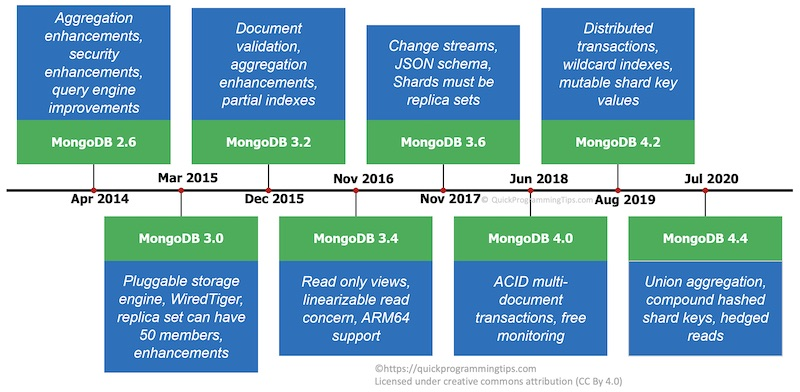

## 缓存
[缓存穿透、缓存击穿、缓存雪崩](https://www.damon8.cn/2020/07/27/mq-01/)

## Data Warehouse
[数仓架构发展史](https://www.cnblogs.com/data-magnifier/p/14128335.html)

[深入理解大数据之——Lambda架构](https://jiang-hao.com/articles/2019/big-data-lambda-architecture.html)
>Marz在Twitter工作期间开发了著名的实时大数据处理框架Storm，Lambda架构是其根据多年进行分布式大数据系统的经验总结提炼而成。Lambda架构的目标是设计出一个能满足实时大数据系统关键特性的架构，包括有：高容错、低延时和可扩展等。Lambda架构整合离线计算和实时计算，融合不可变性（Immunability），读写分离和复杂性隔离等一系列架构原则，可集成Hadoop，Kafka，Storm，Spark，Hbase等各类大数据组件。

## 列存储
[列存储格式Parquet浅析](https://www.jianshu.com/p/47b39ae336d5)

## Database

### MongoDB

